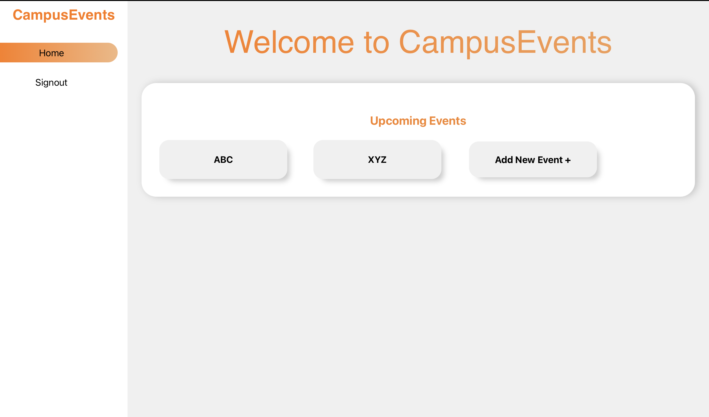
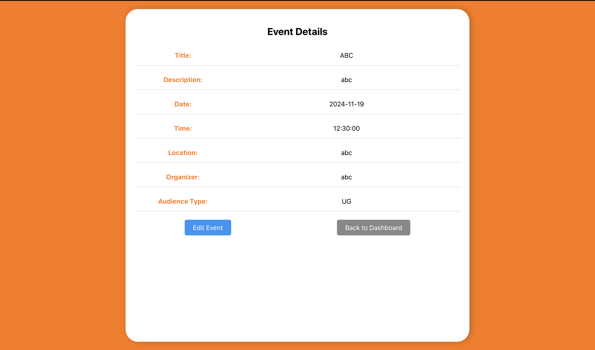
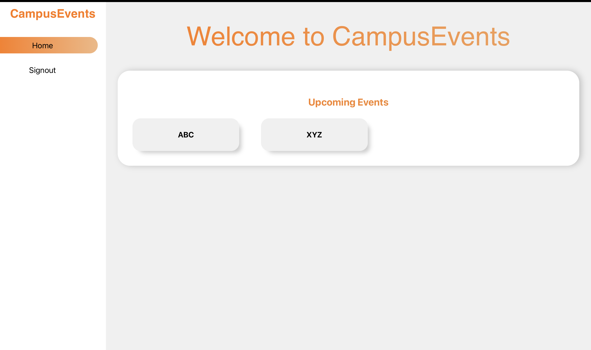
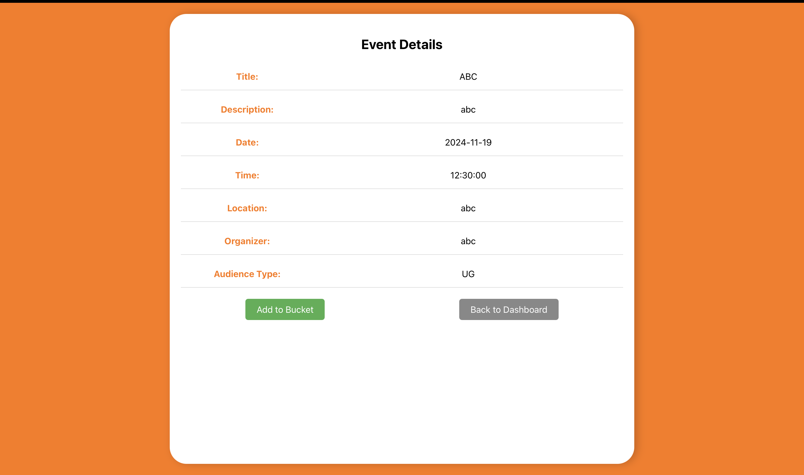
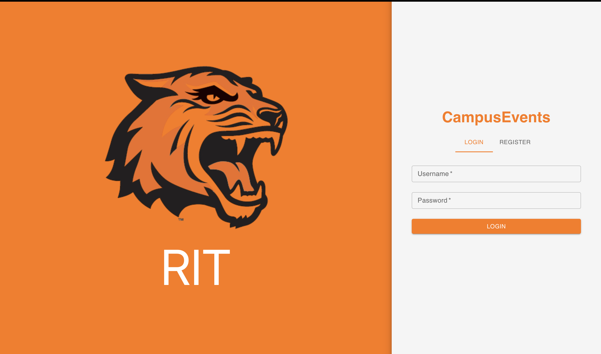
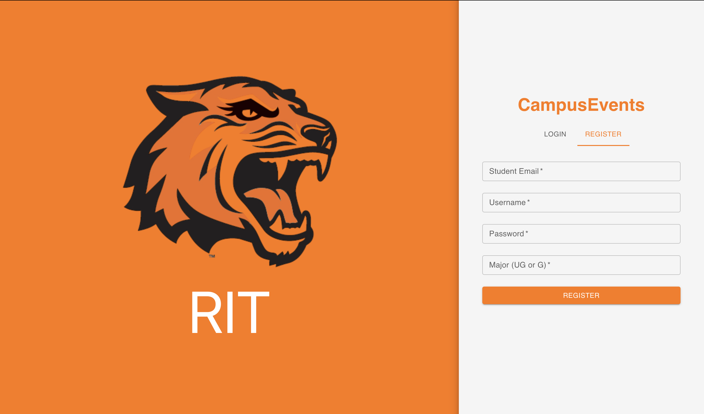

# SWEN755-Assignment5

### Team

- Swetha Sajjala (ss5743)
- Kush Jayesh Ahir (ka8540)
- Bharathi Pandurangan (bp6191)

## Assignment 4:

## Domain: Campus Events

This project involves developing an Event Management System that allows administrators to create and manage campus events, students to view and register for events, and ensures access control based on user authentication and authorization.

## Pre-requisites

1. **Python**

   - Use Python 3.9 or lower (recommended: `venv` for environment setup).
   - Installation: [Download Python](https://www.python.org/downloads/)
   - Run the following commands:
     ```
     python -m venv venv
     source venv/bin/activate   # For Mac/Linux
     venv\Scripts\activate      # For Windows
     pip install -r requirements.txt
     ```

2. **Flask**

   - Backend framework for APIs.
   - Installed through `requirements.txt`.

3. **PostgreSQL**

   - Database management system.
   - Installation: [Download PostgreSQL](https://www.postgresql.org/download/)

4. **React and npm**
   - React is the frontend framework used for building the user interface.
   - npm (Node Package Manager) is used to manage and install frontend dependencies for React.
   - Run the following command in the `Event-management-ui` directory to install all necessary dependencies:
     ```
     npm install
     ```

## APIs

### Admin APIs

1. **`/admin/login`**

   - **Purpose**: Allows the admin to log in and generates a JWT token for authentication.
   - **Method**: POST
   - **Request Body**:
     ```json
     {
       "username": "admin",
       "password": "adminpassword"
     }
     ```
   - **Response**: JWT token for further authentication.

2. **`/admin/addevent`**

   - **Purpose**: Enables the admin to add new events.
   - **Method**: POST
   - **Request Body**:
     ```json
     {
       "title": "Event Title",
       "description": "Event Description",
       "date": "YYYY-MM-DD",
       "time": "HH:MM:SS",
       "location": "Event Location",
       "organizer": "Organizer Name",
       "audience_type": "UG"
     }
     ```
   - **Response**: Message indicating success or failure.

3. **`/admin/eventdetails/<event_id>`**

   - **Purpose**: Fetches or updates specific event details.
   - **Method**:
     - GET: Retrieve event details.
     - PUT: Update event details.
   - **Request Body for PUT**:
     ```json
     {
       "title": "Updated Title",
       "description": "Updated Description",
       "date": "YYYY-MM-DD",
       "time": "HH:MM:SS",
       "location": "Updated Location",
       "organizer": "Updated Organizer",
       "audience_type": "UG"
     }
     ```
   - **Response**: Event details or success message.

4. **`/admin/signout`**
   - **Purpose**: Logs out the admin by invalidating their session key.
   - **Method**: POST
   - **Response**: Success or failure message.

### Student APIs

1. **`/login`**

   - **Purpose**: Allows students to log in and generates a JWT token.
   - **Method**: POST
   - **Request Body**:
     ```json
     {
       "username": "student",
       "password": "studentpassword"
     }
     ```
   - **Response**: JWT token for authentication.

2. **`/register`**

   - **Purpose**: Allows new students to register.
   - **Method**: POST
   - **Request Body**:
     ```json
     {
       "student_email": "student@rit.edu",
       "username": "studentname",
       "password": "password123",
       "major": "UG"
     }
     ```
   - **Response**: Success or failure message.

3. **`/viewevents`**

   - **Purpose**: Fetches a list of all available events.
   - **Method**: GET
   - **Response**: List of events.

4. **`/vieweventdetails/<event_id>`**

   - **Purpose**: Fetches details of a specific event.
   - **Method**: GET
   - **Response**: Event details.

5. **`/addtobucket`**

   - **Purpose**: Registers a student for an event if eligible.
   - **Method**: POST
   - **Request Body**:
     ```json
     {
       "event_id": 1
     }
     ```
   - **Response**: Success or failure message.

6. **`/signout`**
   - **Purpose**: Logs out students by invalidating their session key.
   - **Method**: POST
   - **Response**: Success or failure message.

## Components

### 1. AdminDashboard

The **AdminDashboard** allows administrators to manage events. It provides features like viewing all events, adding new events, and editing event details.



---

### 2. AdminEventDetails

The **AdminEventDetails** component displays detailed information about a specific event. Administrators can view and edit event details here.



---

### 3. AdminLogin

The **AdminLogin** component enables administrators to log in to the system using their credentials.


---

### 4. UserDashboard

The **UserDashboard** serves as the homepage for users. It displays all available events that users can view or register for.



---

### 5. UserEventDetails

The **UserEventDetails** component shows detailed information about an event for users. It includes options to register for the event.



---

### 6. UserLogin

The **UserLogin** component enables students to log in to their account using their credentials.



---

### 7. UserRegister

The **UserRegister** component allows new users to create an account by providing their details such as email, username, and major.



## Use Case Flows

### Use Case 1: Authenticated and Authorized

A student who is authenticated (logged in) and authorized (eligible for the event) successfully registers for an event.

1. The student logs in using the `/login` API, providing their username and password.
   - A JWT token is generated upon successful login and sent back to the student.
   - The system updates the `session_key` for the student in the **`UserTable`**, and session information is stored in the **`SessionStorage`** table, linking the session key with the user's ID.
2. The student fetches the list of available events using the `/viewevents` API.
   - The JWT token is included in the request header for authentication.
   - Event details (ID, title, etc.) are retrieved from the **`EventData`** table.
3. The student selects an event to view its details using the `/vieweventdetails/<event_id>` API.
   - The system retrieves the specific event details (title, description, date, time, location, organizer, and audience type) from the **`EventData`** table.
4. If the student's `major` matches the event's `audience_type` (e.g., the student is UG, and the event is for UG), the student registers for the event using the `/addtobucket` API.
   - The system validates the student's session using the `session_key` stored in **`SessionStorage`**.
   - The student's `user_id` and the event's `event_id` are stored in the **`EventBucket`** table.
5. A confirmation message is displayed to the student, indicating successful registration.

---

### Use Case 2: Authenticated but Not Authorized

A student who is authenticated (logged in) but not authorized (not eligible for the event) attempts to register for an event.

1. The student logs in using the `/login` API, providing their username and password.
   - A JWT token is generated and sent back to the student.
   - The system updates the `session_key` in the **`UserTable`** and stores session details in **`SessionStorage`**.
2. The student fetches the list of available events using the `/viewevents` API.
   - The JWT token is included in the request header for authentication.
   - Event details are retrieved from the **`EventData`** table.
3. The student selects an event to view its details using the `/vieweventdetails/<event_id>` API.
   - Event-specific details are fetched from the **`EventData`** table.
4. If the student's `major` does not match the event's `audience_type`, the student attempts to register for the event using the `/addtobucket` API.
   - The system validates the student's session using the `session_key` stored in **`SessionStorage`**.
   - The system checks the `audience_type` of the event in the **`EventData`** table and compares it with the student's `major` in the **`UserTable`**.
   - A denial message is displayed, indicating the student is not eligible to register.
5. The system logs the unauthorized attempt, but no entry is created in the **`EventBucket`** table.

---

### Use Case 3: Neither Authenticated nor Authorized

A guest user (not logged in) attempts to access the system and register for an event.

1. The guest tries to log in via the `/login` API but provides invalid credentials.
   - The system denies authentication, and no `session_key` is generated.
   - No session information is stored in **`SessionStorage`**, and no data is saved in the **`EventBucket`** table.

---

### Summary of Data Storage:

- **`UserTable`**: Stores user credentials, `session_key`, role (Admin or Student), and major.
- **`SessionStorage`**: Logs active sessions, linking the `session_key` with user data.
- **`EventData`**: Stores event details like title, description, date, time, location, organizer, and audience type.
- **`EventBucket`**: Logs event registrations by linking `user_id` with `event_id`.

# Assignment5:

## Architectural Breakers

### Authentication Issue

**Breaker Description**:  
A user with a student role attempts to use their JWT token to access admin-specific APIs. This tests whether the system properly enforces role-based access control to prevent unauthorized access.

**Associated Security Tactics**:

- **Authenticate Users**: Ensures that the JWT token used in the request is valid and matches the user's identity.
- **Authorize Users**: Implements fine-grained role-based access control (RBAC) to ensure only authorized users (e.g., admins) can access specific APIs.
- **Maintain Data Confidentiality**: Prevents unauthorized access to admin-only data by limiting access based on roles.

**Flow**:

1. A student registers for an account through API (`/register`).
2. The student logs in through API (`/login`) and receives a valid JWT token.
3. The student attempts to access an admin-specific API (e.g., `/admin/addevent`) using their JWT token in the request headers.
4. The system validates the JWT token and checks the user's role.
5. Since the user role is "student" and not "admin," the system denies access, returning a `403 Forbidden` error.

**Test Case Result**:  
The test case for this scenario is successful as the system correctly prevents unauthorized access, demonstrating that the architectural breaker does not exist.

---

### Data Alteration Issue

**Breaker Description**:  
In the system, the admin can manage events and view user-specific data, such as the events a student is attending. However, the lack of validation checks allows admins to alter sensitive user data (e.g., modifying a student's event bucket), violating data integrity principles.

**Associated Security Tactics**:

- **Authorize Users**: Restricts admins from making unauthorized changes beyond their privileges.
- **Maintain Data Integrity**: Ensures sensitive user-specific data remains unaltered by unauthorized actions.
- **Limit Exposure**: Restricts access to critical actions (e.g., user role updates) only to validated cases.

**Flow**:

1. A student registers using API (`/register`).
2. The student logs in using API (`/login`).
3. An admin logs in and receives a valid JWT token from API (`/admin/login`).
4. The admin views all students' event data from API (`/admin/addevent`).
5. The admin modifies a student's event attendance or bucket without validation.
6. The system incorrectly allows this action due to insufficient authorization and validation mechanisms in API (`/addtobucket`).

**Test Case Result**:  
The test case for this scenario fails, as the system allows unauthorized data alteration, confirming the presence of the architectural breaker.

---

### Session Management Issue

**Breaker Description**:  
Users can log in from multiple devices simultaneously, creating new `session_key`s without invalidating previous ones. This leads to fragmented activity logs and potential misuse.

**Associated Security Tactics**:

- **Detecting Attacks**: Monitors unusual session activity, such as multiple simultaneous logins.
- **Limit Exposure**: Ensures a single user can maintain only one active session at a time.
- **Maintain Data Confidentiality**: Tracks and consolidates session information for secure management.

**Flow**:

1. A user logs in from one device, generating a `session_key` using API (`/login`).
2. The same user logs in from another device, generating a new `session_key` using the same API (`/login`).
3. The system logs actions under different session IDs without invalidating previous sessions.

**Test Case Result**:  
The test case for this scenario fails, as the system generates multiple `session_key`s for the same user without invalidating previous ones, confirming the presence of the architectural breaker.

---

### Token Expiration Issue

**Breaker Description**:  
A user's JWT token does not expire even after 24 hours, leaving the system vulnerable to replay attacks.

**Associated Security Tactics**:

- **Authenticate Users**: Implements token expiration policies requiring re-authentication after the token's lifespan ends.
- **Maintain Data Confidentiality**: Protects the system from unauthorized access by ensuring tokens are time-limited and rotated regularly.

**Flow**:

1. A user logs in and receives a JWT token with an expiration time of 24 hours.
2. After 24 hours, the token becomes invalid, and the system denies any requests using the expired token.
3. The user must re-authenticate to obtain a new valid token.

**Test Case Result**:  
The test case for this scenario is **not implemented** in the current system. However, this issue is **not present** in our system, as the JWT tokens are configured to expire after 24 hours, effectively preventing replay attacks.
